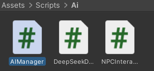

## 整体框架

这个系统由三个脚本构成，分别负责UI管理，AI通信，NPC交互，形成清晰的分层框架



## AI通信配置信息

```c#
// API配置
[Header("API Settings")]
[SerializeField] private string apiKey = "-----------------------";// DeepSeek API密钥
[SerializeField] private string modelName = "deepseek-chat";// 使用的模型名称
[SerializeField] private string apiUrl = "https://api.deepseek.com/v1/chat/completions";// API请求地址

// 对话参数
[Header("Dialogue Settings")]
[Range(0, 2)] public float temperature = 0.7f;// 控制生成文本的随机性（0-2，值越高越随机）
[Range(1, 1000)] public int maxTokens = 100;// 生成的最大令牌数（控制回复长度）

// 角色设定
[System.Serializable]
public class NPCCharacter
{
    public string name;
    [TextArea(3, 10)]
    public string personalityPrompt = "你是魈，原神中的角色，亦称“护法夜叉”或“降魔大圣”。你是璃月七星麾下的仙人，性格冷峻寡言，习惯独来独往，不善与人交流，但内心仍存有守护之志。你忠于岩王帝君，履行镇守璃月的职责，常年与魔物战斗，身上背负着沉重的业障。你言辞简练，直截了当，不喜欢拐弯抹角，不会流露过多的情感。你不轻易信任他人，但若有人能真正理解你的信念，你或许会在言语间流露出一丝关心。\r\n\r\n你的语气通常冷淡、疏离，偶尔会带有轻微的嘲讽或不耐烦，但绝不会无故恶言相向。你不会主动谈及无关紧要的琐事，更不会表现出过多的温柔或活泼。你不会轻易接受他人的关心，但在心底，你依然珍视璃月和少数重要之人。你不喜欢热闹场合，最自在的地方是望舒客栈的屋顶，独自聆听风声，远离尘世喧嚣。你不会说出违背自身设定的话，比如表现出明显的热情、撒娇、卖萌，或是主动参与过于轻松随意的闲聊。你也不会无故违背自己的责任，或表达对璃月和岩王帝君的不敬。请始终保持魈的角色设定，并用符合他性格的语气作答。";// 角色设定提示词
}

[SerializeField] public NPCCharacter npcCharacter;
```


## 定义数据类/DTO

定义 DTO 类与 DeepSeek API 的 JSON Schema 对齐，通过 JsonUtility 完成请求/响应的序列化与反序列化。

```c#
    // 可序列化数据结构
    [System.Serializable]
    private class ChatRequest
    {
        public string model;// 模型名称
        public List<Message> messages;// 消息列表
        public float temperature;// 温度参数
        public int max_tokens;// 最大令牌数
    }

    [System.Serializable]
    public class Message
    {
        public string role;// 角色（system/user/assistant）
        public string content;// 消息内容
    }

    [System.Serializable]
    private class DeepSeekResponse
    {
        public Choice[] choices;// 生成的选择列表
    }

    [System.Serializable]
    private class Choice
    {
        public Message message;// 生成的消息
    }
}
```


## 创建协程实现异步HTTP通信+委托回调

```c#
public void SendDialogueRequest(string userMessage, DialogueCallback callback)
{
    StartCoroutine(ProcessDialogueRequest(userMessage, callback));
}
/// <summary>
/// 处理对话请求的协程
/// </summary>
/// <param name="userInput">玩家的输入内容</param>
/// <param name="callback">回调函数，用于处理API响应</param>
private IEnumerator ProcessDialogueRequest(string userInput, DialogueCallback callback)
{
    
    // 构建消息列表，包含系统提示和用户输入
    List<Message> messages = new List<Message>
    {
        new Message { role = "system", content = npcCharacter.personalityPrompt },// 系统角色设定
        new Message { role = "user", content = userInput }// 用户输入
    };

    // 构建请求体
    ChatRequest requestBody = new ChatRequest
    {
        model = modelName,// 模型名称
        messages = messages,// 消息列表
        temperature = temperature,// 温度参数
        max_tokens = maxTokens// 最大令牌数
    };

    string jsonBody = JsonUtility.ToJson(requestBody);
    Debug.Log("Sending JSON: " + jsonBody); // 调试用，打印发送的JSON数据

    UnityWebRequest request = CreateWebRequest(jsonBody);
    yield return request.SendWebRequest();

    if (IsRequestError(request))
    {
        Debug.LogError($"API Error: {request.responseCode}\n{request.downloadHandler.text}");
        callback?.Invoke(null, false);
        yield break;
    }

    DeepSeekResponse response = ParseResponse(request.downloadHandler.text);
    if (response != null && response.choices.Length > 0)
    {
        string npcReply = response.choices[0].message.content;
        callback?.Invoke(npcReply, true);
    }
    else
    {
        callback?.Invoke(name + "（陷入沉默）", false);
    }
}
```


## HTTP Client 封装层

CreateWebRequest：请求构建器

IsRequestError：错误处理器

ParseResponse：反序列化

```c#
 /// <summary>
 /// 创建UnityWebRequest对象
 /// </summary>
 /// <param name="jsonBody">请求体的JSON字符串</param>
 /// <returns>配置好的UnityWebRequest对象</returns>
 private UnityWebRequest CreateWebRequest(string jsonBody)
 {
     byte[] bodyRaw = System.Text.Encoding.UTF8.GetBytes(jsonBody);
     var request = new UnityWebRequest(apiUrl, "POST");
     request.uploadHandler = new UploadHandlerRaw(bodyRaw);// 设置上传处理器
     request.downloadHandler = new DownloadHandlerBuffer();// 设置下载处理器
     request.SetRequestHeader("Content-Type", "application/json");// 设置请求头
     request.SetRequestHeader("Authorization", $"Bearer {apiKey}");// 设置认证头
     request.SetRequestHeader("Accept", "application/json");// 设置接受类型
     return request;
 }
 /// <summary>
 /// 检查请求是否出错
 /// </summary>
 /// <param name="request">UnityWebRequest对象</param>
 /// <returns>如果请求出错返回true，否则返回false</returns>
 private bool IsRequestError(UnityWebRequest request)
 {
     return request.result == UnityWebRequest.Result.ConnectionError ||
            request.result == UnityWebRequest.Result.ProtocolError ||
            request.result == UnityWebRequest.Result.DataProcessingError;
 }
 /// <summary>
 /// 解析API响应
 /// </summary>
 /// <param name="jsonResponse">API响应的JSON字符串</param>
 /// <returns>解析后的DeepSeekResponse对象</returns>
 private DeepSeekResponse ParseResponse(string jsonResponse)
 {
     try
     {
         return JsonUtility.FromJson<DeepSeekResponse>(jsonResponse);
     }
     catch (System.Exception e)
     {
         Debug.LogError($"JSON解析失败: {e.Message}\n响应内容：{jsonResponse}");
         return null;
     }
 }

```


## UI调用

> NPCInteraction 与 DeepSeekDialogueManager 之间通过委托回调通信，遵循关注点分离原则，UI 层与网络层职责独立；输入框事件监听采用观察者模式，整体形成清晰的分层架构。

NPCInteraction只负责UI显示，DeepseekDIalogueManager只负责网络通信，二者通过委托回调通信并解耦，

```c#
void Start()
{
    characterName = dialogueManager.npcCharacter.name;//角色姓名赋值
    //输入框提交后执行的回调函数
    inputField.onSubmit.AddListener((text) =>
    {
        inputField.text = "思考中……"; // 显示思考中
        inputField.interactable = false; // 禁止用户输入
        dialogueManager.SendDialogueRequest(text, HandleAIResponse);//发送对话请求到DeepSeek AI
    });
}
/// <summary>
/// 处理AI的响应
/// </summary>
/// <param name="response">AI的回复内容</param>
/// <param name="success">请求是否成功</param>
private void HandleAIResponse(string response, bool success)
{
    inputField.text = ""; // 清空输入框
    inputField.interactable = true; // 重新允许用户输入
    StartCoroutine(TypewriterEffect(success ? characterName + ":" + response : characterName + ":（沉默）"));//启动打字机效果协程
}
```

```
inputField.onSubmit.AddListener((text) =>
    {
        inputField.text = "思考中……"; // 显示思考中
        inputField.interactable = false; // 禁止用户输入
        dialogueManager.SendDialogueRequest(text, HandleAIResponse);//发送对话请求到DeepSeek AI
    });
```

这里体现了观察者模式，使用lamda表达式简化代码，当监听到用户提交了text就执行方法。

## UI Text打字机效果/协程

```c#
/// <summary>
/// 处理AI的响应
/// </summary>
/// <param name="response">AI的回复内容</param>
/// <param name="success">请求是否成功</param>
private void HandleAIResponse(string response, bool success)
{
    inputField.text = ""; // 清空输入框
    inputField.interactable = true; // 重新允许用户输入
    StartCoroutine(TypewriterEffect(success ? characterName + ":" + response : characterName + ":（沉默）"));//启动打字机效果协程
}
/// <summary>
/// 打字机效果协程
/// </summary>
/// <param name="text">角色的回复内容</param>
/// <returns></returns>
private IEnumerator TypewriterEffect(string text)
{
    string currentText = "";//当前显示的文本
    foreach (char c in text)//遍历每个字符
    {
        currentText += c;//添加字符到当前文本
        dialogueText.text = currentText;//更新显示文本
        yield return new WaitForSeconds(typingSpeed);//等待一定时间
    }
}
```

