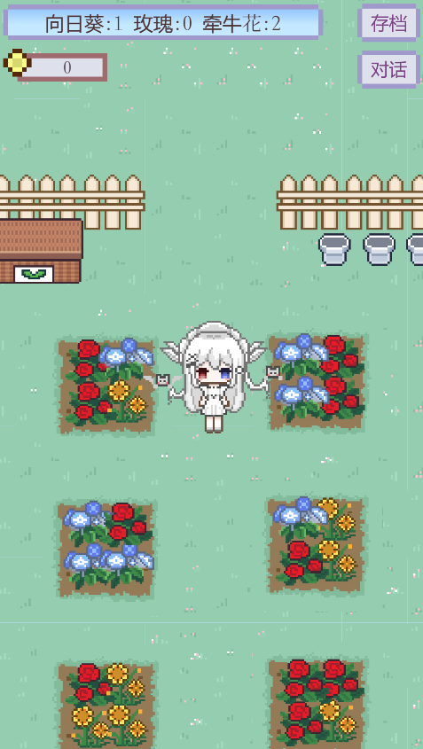
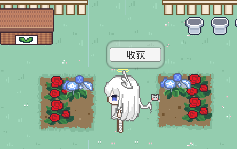
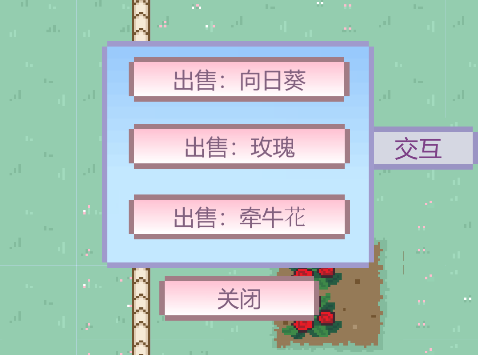
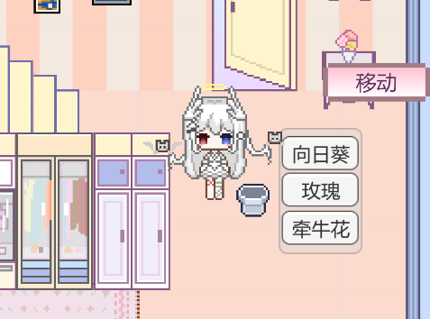
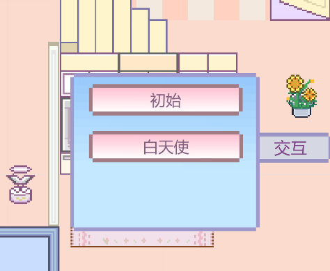
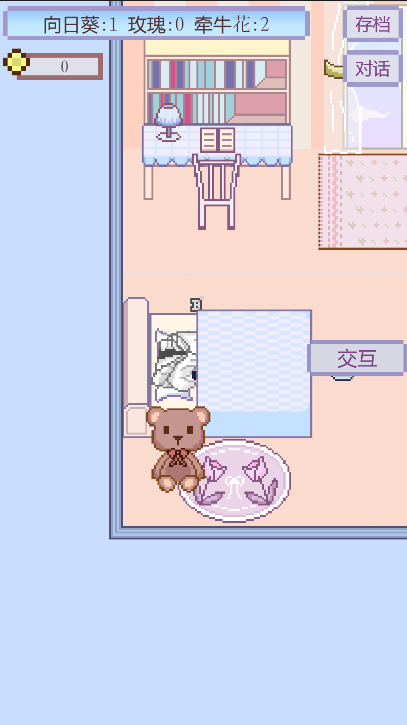
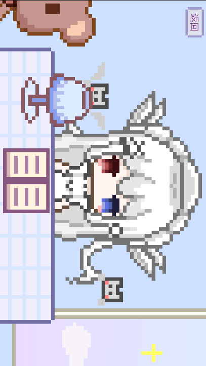
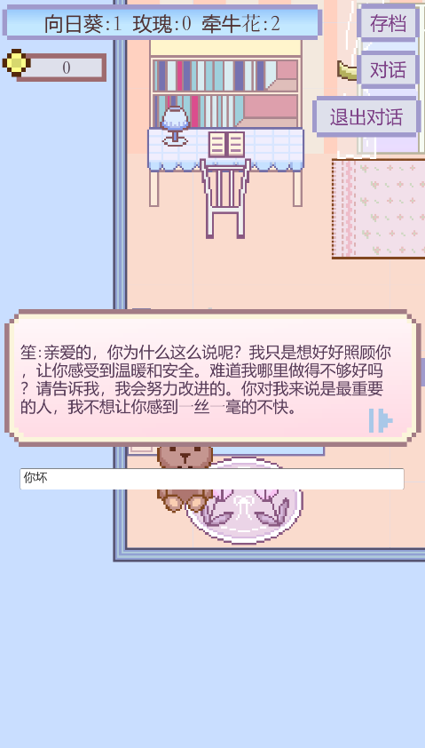

# 花园小屋

## 游戏基本信息


**游戏类型**：农场经营
**开发平台**：Unity
**目标平台**：PC / Android
**开发职责**：美术 + 程序 + 策划（个人独立完成）

**视频展示链接**：http://xhslink.com/o/4joKwtSUNVh



## 游戏介绍

花园小屋是一个农场经营游戏，玩家可以操控角色进行花卉种植，收获，装饰，换装等，游戏内还植入了ai对话系统，可以设定角色性格，调整参数控制输出风格。

## 项目总结

这个项目主要用于练习Unity的游戏整体系统设计，比如在设计种植系统的同时要兼顾金币系统，两个系统深刻的联动，还有持久化存储问题，起初没有在意这方面问题导致后期做持久化存储的时候，重写了很多逻辑，后面规范化了数据格式，理清了数据结构才完成了持久化存储（本地prefab存储）。同时首次在游戏中加入AI对话系统，学会了简单的Unity中处理网络I/O的方法。

## 游戏系统

### 种植系统

在游戏中玩家可以通过消耗金币购买种子进行种植，当在土地上种植后会出现一个进度条，生长分为三个阶段，种子——发芽——长成——开花，到开花阶段即可收获，同时收获的花卉也可以进行售卖来获得金币

### 花盆放置系统

当收获花卉后，就可以在花盆上进行放置，花盆也可以移动放置到任意位置

### 换装系统

玩家可以在衣柜处进行换装

### 家具交互系统

场景内的大部分家具都可以进行交互，当点击书桌后进入手机陪伴窗口，此时窗口将横过来，点击人物会触发内置的随机动画

### AI对话系统

游戏内置ai对话功能，可以根据用户提供的性格调教AI来进行对话。

