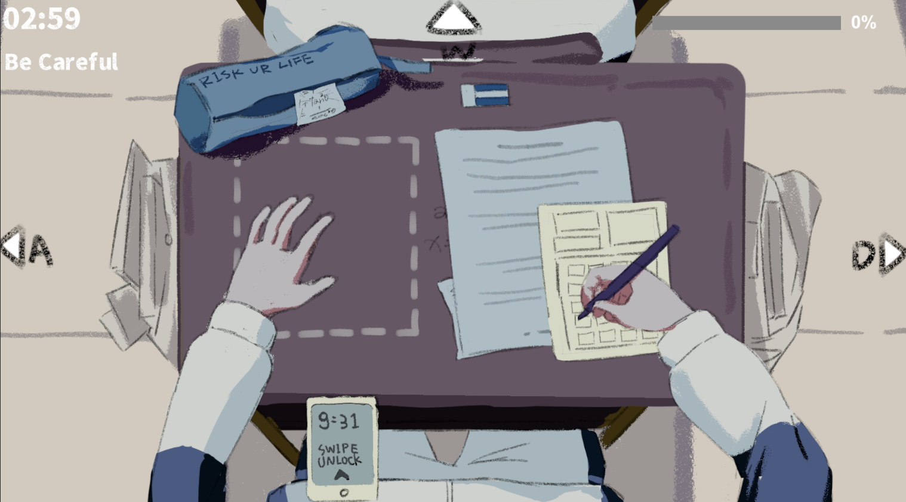
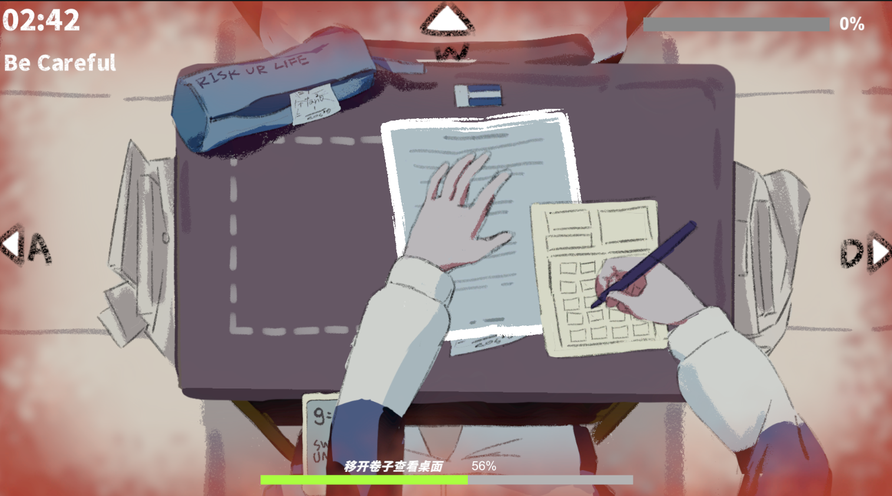
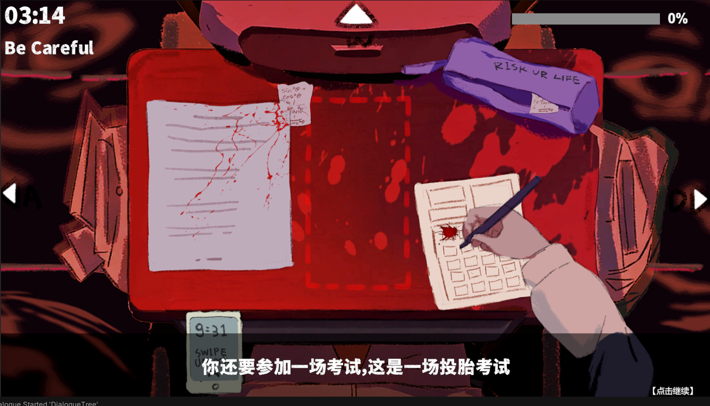
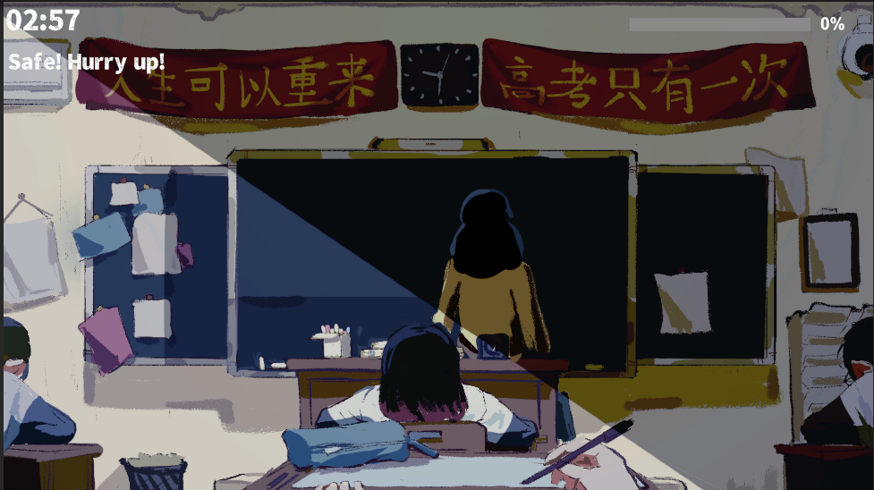


**游戏类型**：农场经营
**开发平台**：Unity
**目标平台**：PC / Android
**开发职责**：程序 + 策划

**视频展示链接**：http://xhslink.com/o/6NpvSS7fYxS



# 作品简介

《地府投胎也要考试作弊？！》是一款作弊手部模拟器，通过不同的按键做出不同的手势以交互桌面上的物品完成作弊，玩家要时刻注意老师的动向和脚步提示及时停止作弊防止被抓。

