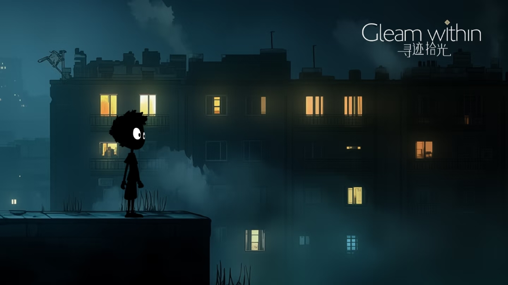
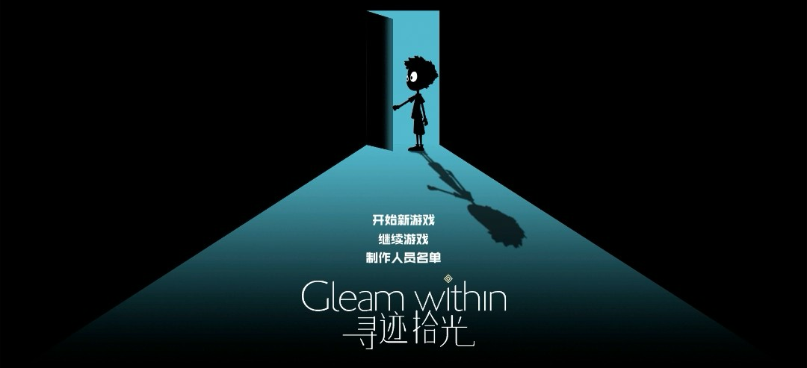
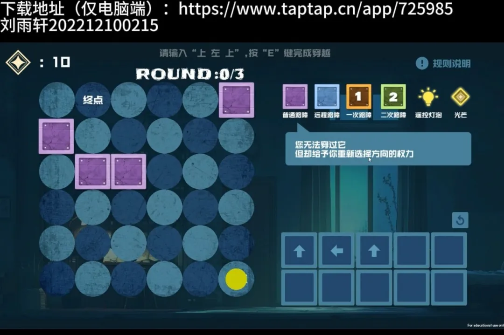
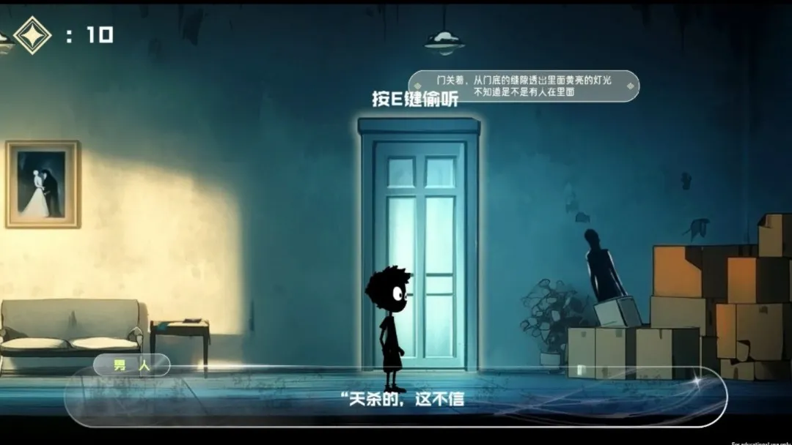
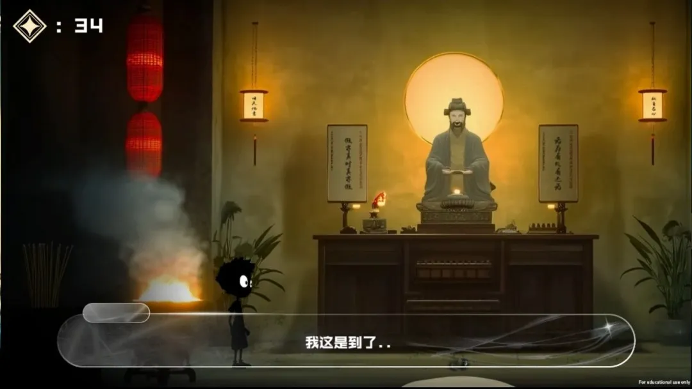


**游戏类型**：策略解密剧情
**开发平台**：Unity
**目标平台**：PC
**开发职责**：程序

**作品详情页链接**：  https://tap.cn/lgGG7vqv7



# 作品简介

《寻迹拾光》这是一款梦核背景下的策略解密剧情游戏，玩家在一场循环噩梦中得知了城市明天将要遭受核打击的消息，而在太阳升起前，玩家可以选择去到各个市民的家里通知消息，劝说市民离开，玩家需要通过策略迷宫和一系列闯关小游戏来说服市民，当然游戏选择是自由的，玩家也可以选择隐瞒这个消息独自逃走。

# 玩法简介

游戏内的剧情走向按照下图所示的迷宫棋盘的胜败来决定，玩家需要预输入小球的箭头走向，迷宫内的方块在小球碰到后会反弹或者触发对应机关。剧情会引导玩家在迷宫中多多收集光芒，迷宫游戏的成败和光芒数量将决定剧情分支走向

# 作品立意

这个游戏的灵感源于一场梦：我打开门跑到了邻居家里，在躲藏的过程中听到了城市将要毁灭的消息。而我在穿行各个不同角色的家中，或打听、或劝说，却从不同的视角中收集到迥异的消息。梦中的我决定将其公之于众，整个城市都慌乱起来。但等待天明，太阳照常升起，却发现不过是谣言，这时大家的表现都好似忘记了这也发生的一切。

结局的判定条件由“光芒值”（关卡与交互时获得）与在播音员处的选择决定（选择全市播报拯救大家/不播报自己逃走）。二者互相独立，互不影响，因此有4个结局，理所应当。而当你不做任何触发，选择在一开始便不开门、回到床上继续睡觉，则会走向隐藏结局（即原定结局5）。如果剧情本身容量无法完成故事的完整塑造，那我们希望给予玩家尽可能自由的游玩体验——一切选择权在你。这符合梦境中以你为主体的设定，也是梦的走向波诡云谲的体现。

我们在结局设计了一个“预言悖论”，这是一场真实上演的电车难题：当你将其作为谣言处理时，它确有其事；而当你信以为真并做出努力时，它又变成了谣言。如果是你，你会将其当做谣言处理，还是信以为真？但如果此事关涉到千万人的性命时，你还会做出和之前一样的选择么？

在思考结局时，不知为何，我的脑海中想到的是一个做出同样选择的医生——新冠疫情的吹哨人李文亮。当他顶着舆论压力，将一件被误报为谣言的消息公之于众时，是否也经历了上述的考量？在我看来，李医生就是那“星星之火”，小小人儿拯救世界的老套故事，就在我的故事中实现吧。这就是《寻迹拾光》的结局一，也是绝大多数人能够达成的结局。就像鲁迅先生说的一样：“有一分热，发一份光......此后如竟没有炬火，我便是唯一的光”，你愿意顶着巨大的压力去选择播报消息，愿意承担谣言的后果，群众和历史就会记住你、会支持你。法不容情但法亦有情，没人会让英雄蒙冤，你是小小的火苗，却掀起群众大大的光芒，你照亮了他们，他们也同样照耀着你。

以上是这次游戏最核心的主题——**“勇气、正义与抉择”**，为了让多数人能在第一次游玩（因为估计很多人不会再玩第二次了）时就理解到游戏与这次比赛主题的关联，我们也将这个结局的达成门槛调至很低，“英雄主义”没有高低贵贱之分，希望大家都能成为自己的英雄，都能成为照亮自己、照亮他人的光。
