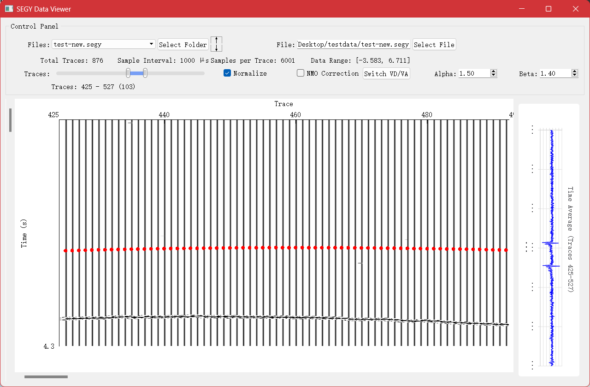
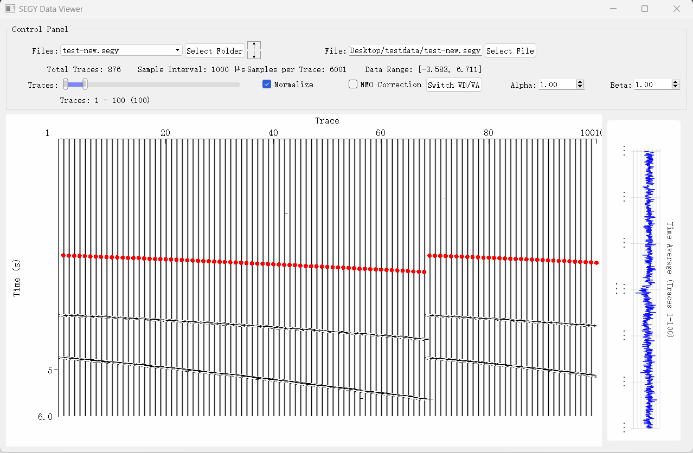

# 项目介绍

针对专业地震 SEG-Y 数据的可视化桌面软件，解决大规模地震采样数据的解析、展示与交互分析需求。开发字节流解析框架，支持IBM/IEEE 浮点转换及多字节序自动识别；实现变面积（VA）与变密度（VD）两种地震剖面渲染模式；自定义 QWidget 实现了支持实时平移与缩放的高性能渲染控件，满足工业级波形显示精度要求。

# 项目功能演示

## 文件夹读取和选取功能

## NMO校正和缩放功能

## 波形自定义Alpha和Beta功能

