
**游戏类型**：农场经营+宠物养成
**开发平台**：Unity
**目标平台**：PC / Android
**开发职责**：美术 + 程序 + 策划（个人独立完成）

**视频展示链接**： http://xhslink.com/o/7YHBYFriyGH



这个宝可梦同人游戏也是脱胎于花园小屋系统，不过其中加入了宠物系统，宠物初始是宝可梦蛋，需要放进孵化器中进行孵化

给宠物设计了随机移动和交互脚本，人物可以抱起宠物移动，对宠物进行喂食清洁等交互，同时这个项目里有时间和存档系统，可以通过睡觉跳过当天

游戏内还有一个对话式选项驱动的厨房交互系统，简单的模拟了做饭玩法

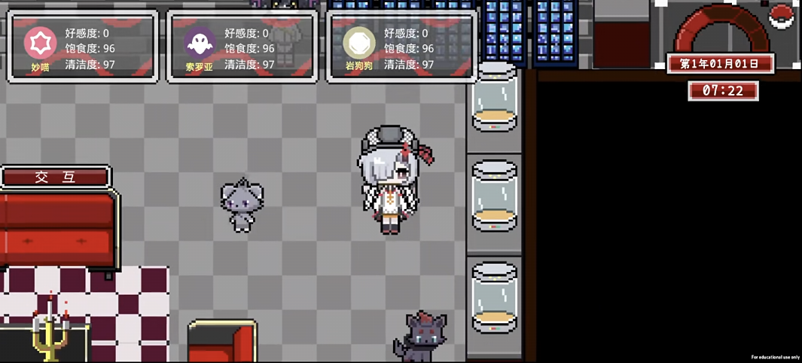


**游戏类型**：农场经营+NPC（宠物）系统+挂机陪伴+AI对话
**开发平台**：Unity
**目标平台**： Android
**开发职责**：美术 + 程序 + 策划（个人独立完成）



这个游戏功能系统跟花园小屋差不多，只不过绘制的素材不同

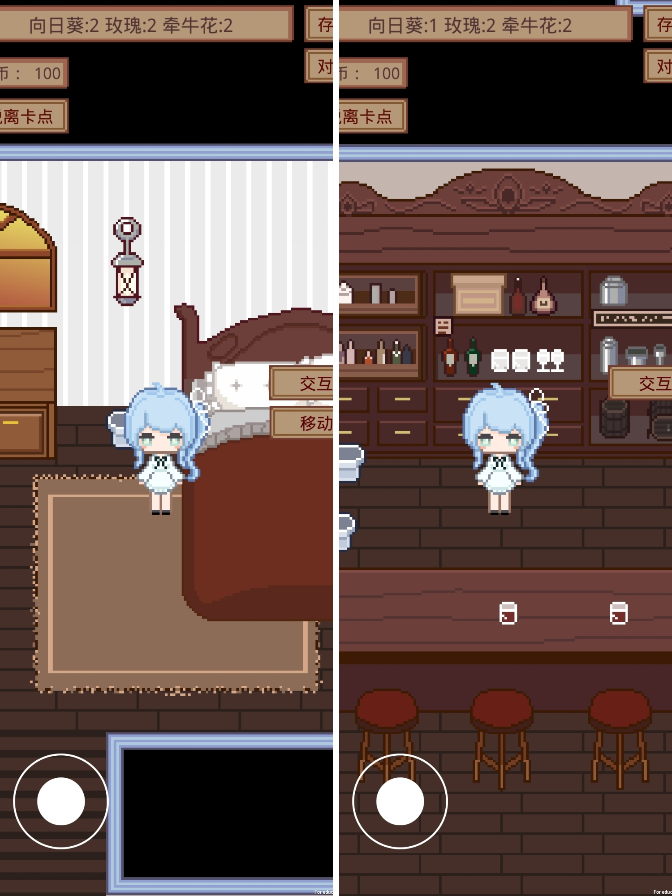

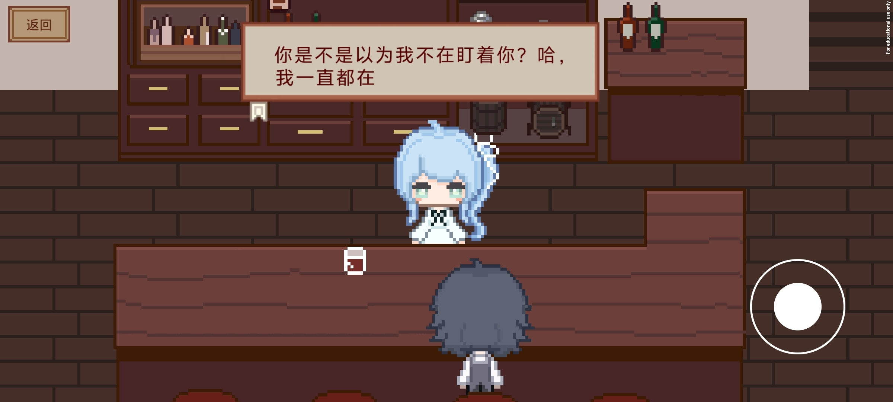

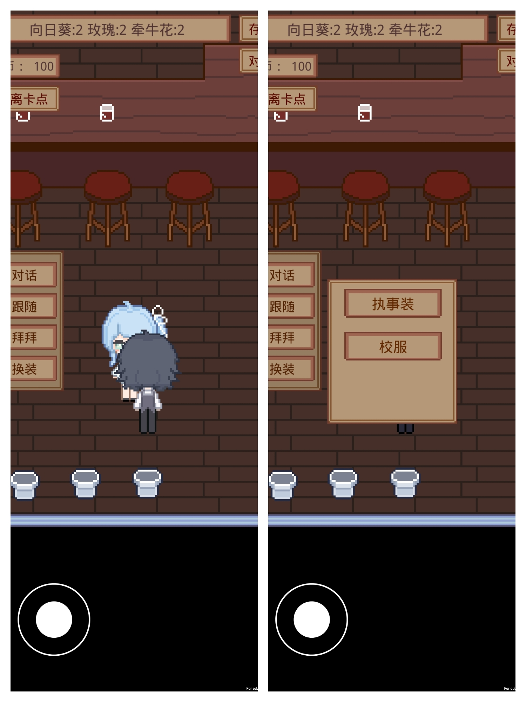


**游戏类型**：农场经营+NPC（宠物）系统+挂机陪伴+AI对话  
**开发平台**：Unity  
**目标平台**：PC  
**开发职责**：美术 + 程序 + 策划（个人独立完成）


这个游戏功能系统跟花园小屋差不多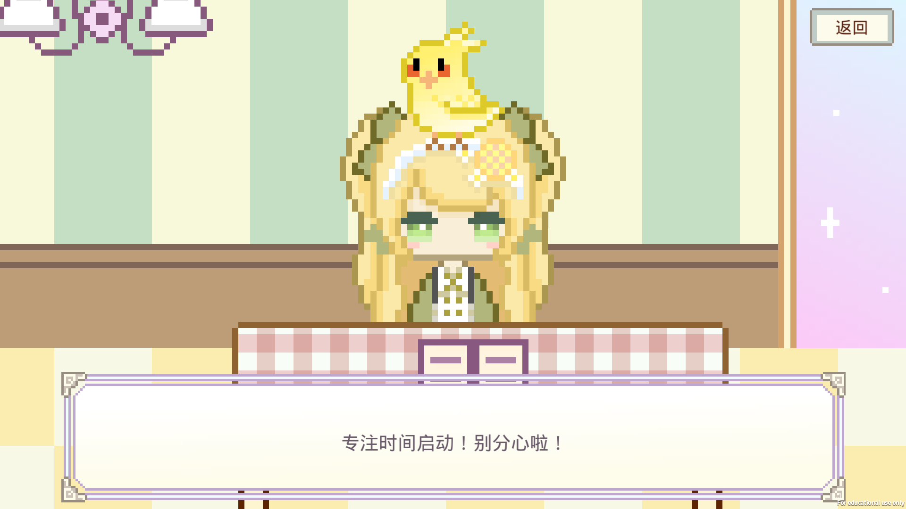，只不过绘制的素材不同

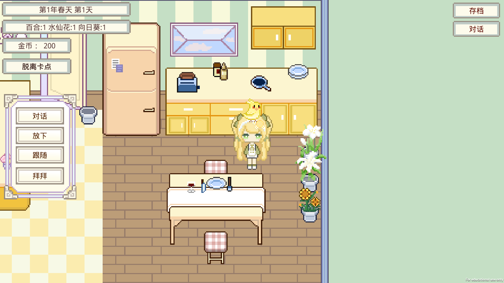

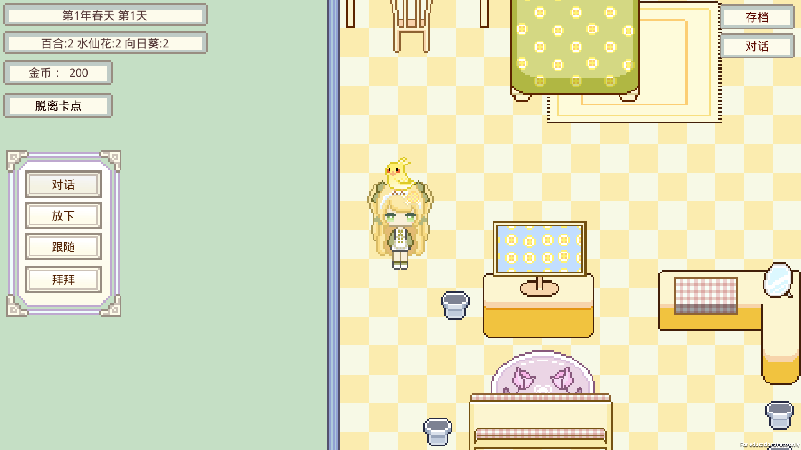

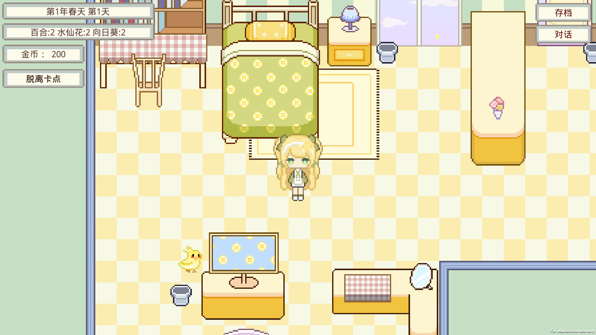


**游戏类型**：家具交互+挂机陪伴+AI对话+灯光渲染
**开发平台**：Unity
**目标平台**：PC 
**开发职责**：美术 + 程序 + 策划（个人独立完成）



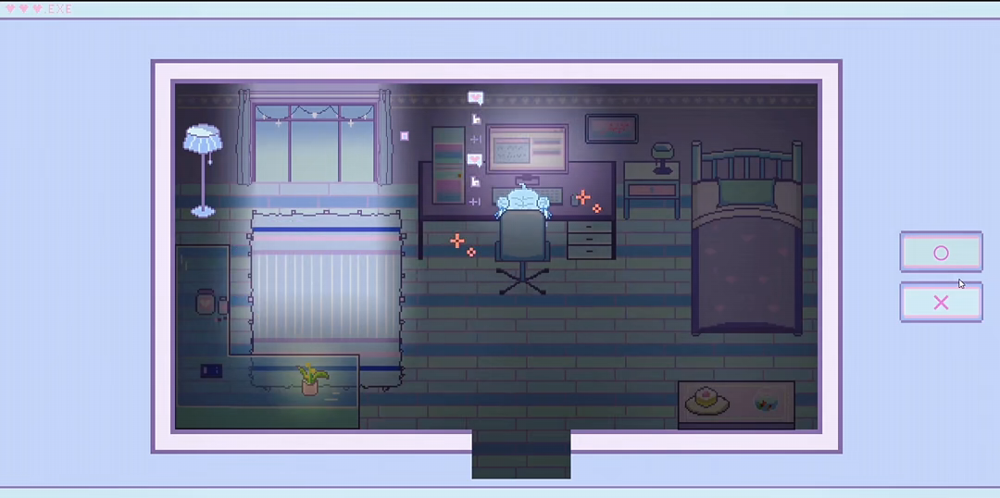

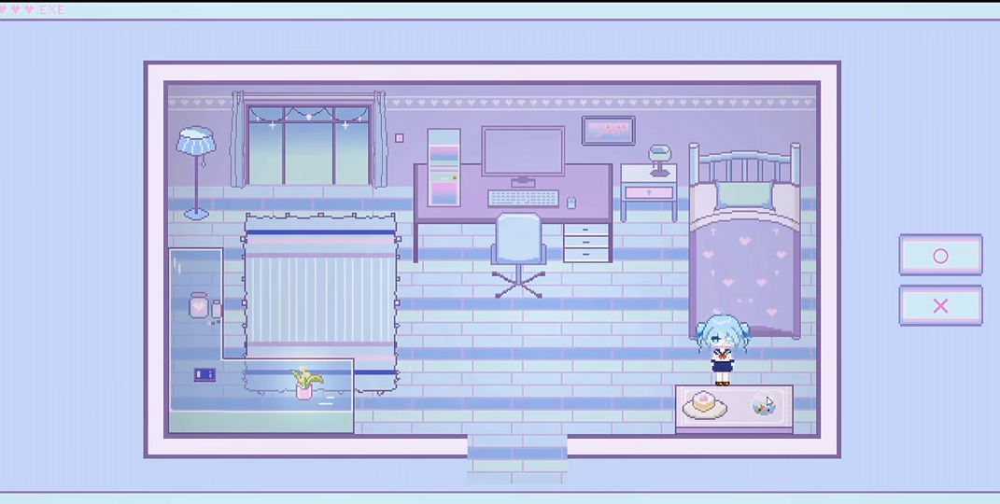

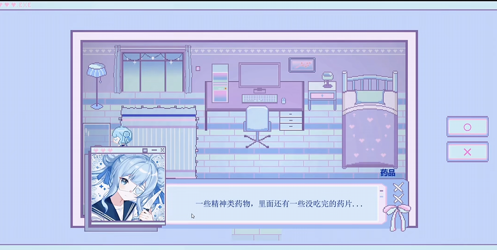
